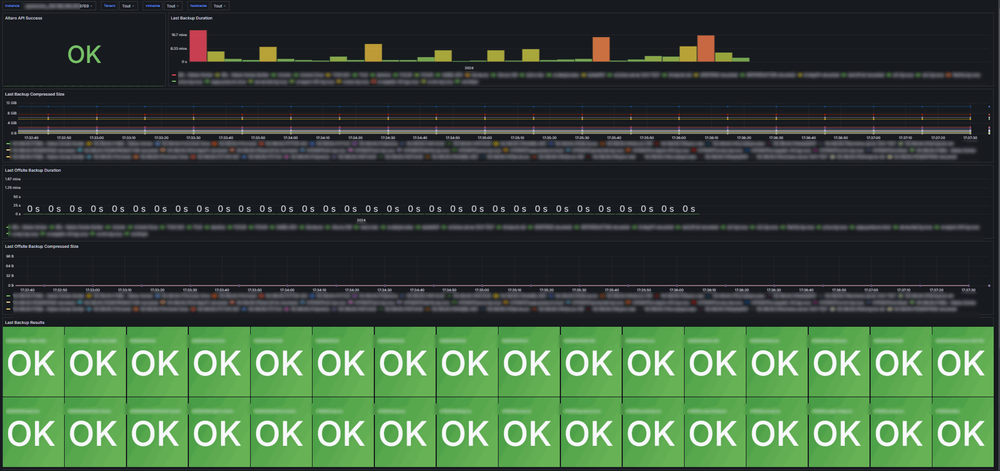

# Altaro / Hornet Security VM Backup Exporter
[](https://opensource.org/license/mit)
[](http://isitmaintained.com/project/netinvent/altaro_exporter "Percentage of issues still open")
[](https://github.com/netinvent/altaro_exporter/releases/latest)
[](https://github.com/netinvent/altaro_exporter/actions/workflows/pylint-windows.yaml)


This is a Hornet Security / Altaro VM Backup v8 and v9 data exporter for Prometheus 

### Grafana Dashboard

You can find an example dashboard in the examples directory



### Install

On the [release page](https://github.com/netinvent/altaro_exporter/releases), you'll find precompiled binaries that are digitally signed.

The exporter needs to be installed on the host that has Altaro VM Backup installed (since discussing with the API from anywhere else fails with `HTTP Error 400. The request hostname is invalid.`)

Extract the zip file to let's say `C:\altaro_exporter`  
In the directory, you'll find the binaries as well as the config file `altaro_exporter.yaml`

Configure your local/domain administrator account according to your needs. Don't worry, once running, the user and password will be encrypted.  
Also, configure if you want to include non scheduled and/or unconfigured VMs in your metrics.  
By default, we include them since it makes sense to have too much information.  
Nevertheless, on a lot of backup policies, they should be excluded in order to avoid false positives.  

Once you're done, create a Windows Service with the following commands

```
sc create altaro_exporter DisplayName= "HornetSecurity Altaro API exporter for Prometheus" start= auto binpath= "c:\altaro_exporter\altaro_exporter-x64.exe -c c:\altaro_exporter\altaro_exporter.yaml"
sc Description altaro_exporter "Altaro API exporter service by NetInvent"
```

Launch the service:
```
sc start altaro_exporter
```

You should now have a running Windows Service as seen in `services.msc`:


You must also enable the Altaro REST API service with the following command:
```
sc config Hornetsecurity.VMBackup.Rest start= auto
sc start Hornetsecurity.VMBackup.Rest
```

You can now query the exporter with:
```
curl http://localhost:9769/metrics
```

### Firewall

The default exporter-port is 9769/tcp, which you can change in the config file.
Keep in mind that you need to create a firewall rule if you want to query it's output.

### Metrics

API status metric 
```
altaro_api_success (0 = OK, 1 = Cannot connect to API, 2 = API didn't like our request)
```

The follwoing metrics have this labels:
` hostname,vmname,vmuuid `

metrics:
```
altaro_lastoffsitecopy_result (0 = Succces, 1 = Warning, 2 = Error, 3 = Unknown, 4 = Other)
altaro_lastbackup_result (0 = Succces, 1 = Warning, 2 = Error, 3 = Unknown, 4 = Other)
altaro_lastoffsitecopy_transfersize_uncompressed_bytes
altaro_lastoffsitecopy_transfersize_compressed_bytes
altaro_lastbackup_transfersize_uncompressed_bytes
altaro_lastbackup_transfersize_compressed_bytes
altaro_lastoffsitecopy_duration_seconds
altaro_lastbackup_duration_seconds
altaro_lastoffsitecopy_timestamp
altaro_lastbackup_timestamp
```

### Alert rules:

```
    - alert: Last Backup not successful
      expr: altaro_lastbackup_result{} > 0
      for: 1m

    - alert: Last OffSite Copy not successful
      expr: altaro_lastoffsitecopy_result{} > 0
      for: 1m

    - alert: Last Backup older than 30 hours
      expr:  time() < 3600 * 30 - altaro_lastbackup_timestamp
      for: 1m

    - alert: Last OffSite Copy older than 30 hours
      expr:  time() < 3600 * 30 - altaro_lastoffsitecopy_timestamp
      for: 1m

```

### Troubeshooting

This program has currently been tested on HornetSecurity v9.0 and v9.1.

By default, the exporter will log to current binary directory into a file named `altaro_exporter.log`
Of course, you can also run the executable manually.  
Depending on your HornetSecurity / Altaro version, you'll have to change the `altaro_rest_port` and `altaro_rest_path` settings accordingly (see the example yaml config file).

### Self compilation

For those who prefer compiling the project themselves, you can install Python >= 3.8 and install requirements in `requirements.txt` and `requirements-compile.txt`.
Once this is done, you can simply launch the `compile.py` script from the root folder of the project. 
Optionally, you can modifiy the settings / icons in the resources directory.   

Note that in order to produce a proper Windows Service, you'll need Nuitka Commercial, please see https://nuitka.net/doc/commercial.html

### Pip packaging

We don't currently provide pip packages since the idea is to execute plain executable windows service files.  
If requested, we can provide pip packages too.

### License

Licensed under MIT License, so do whatever you want with it... Contributions are welcome  
(C) 2024 NetInvent SASU  
(C) 2020 Raphael Pertl

Based on the work of Raphael Pertl available [here](https://github.com/raph2i/altaro_backup_exporter)
